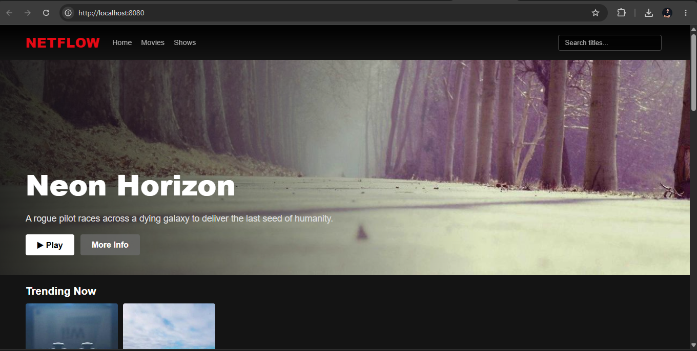
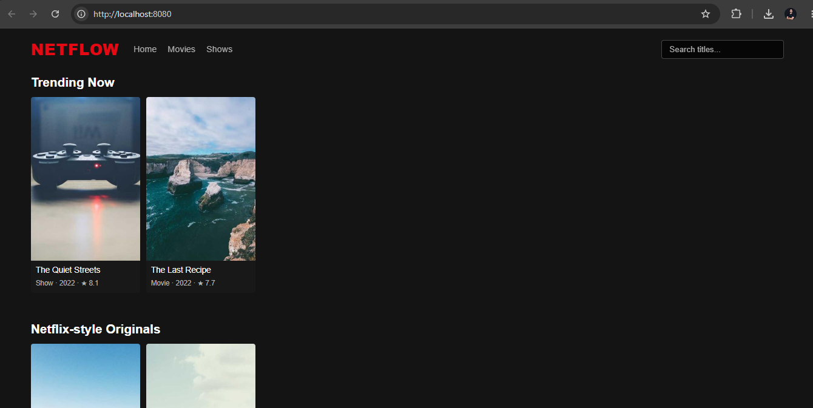
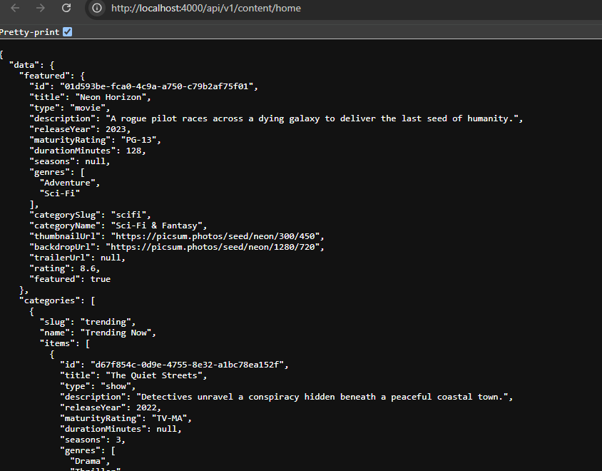
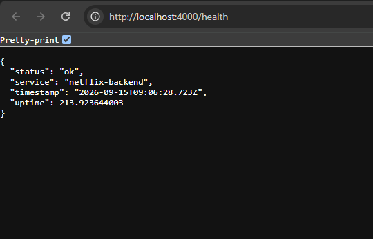
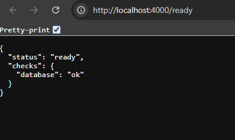
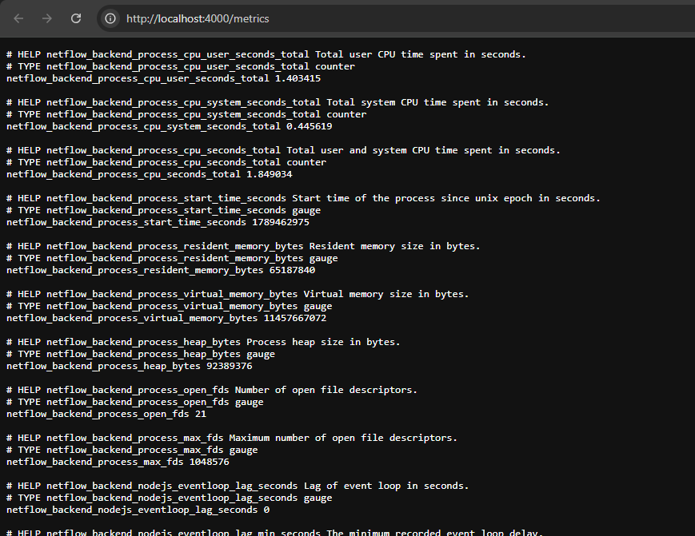
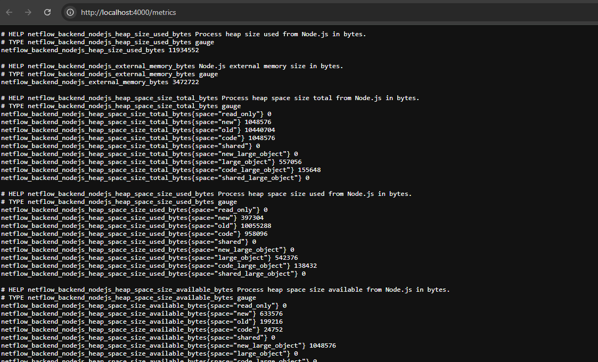
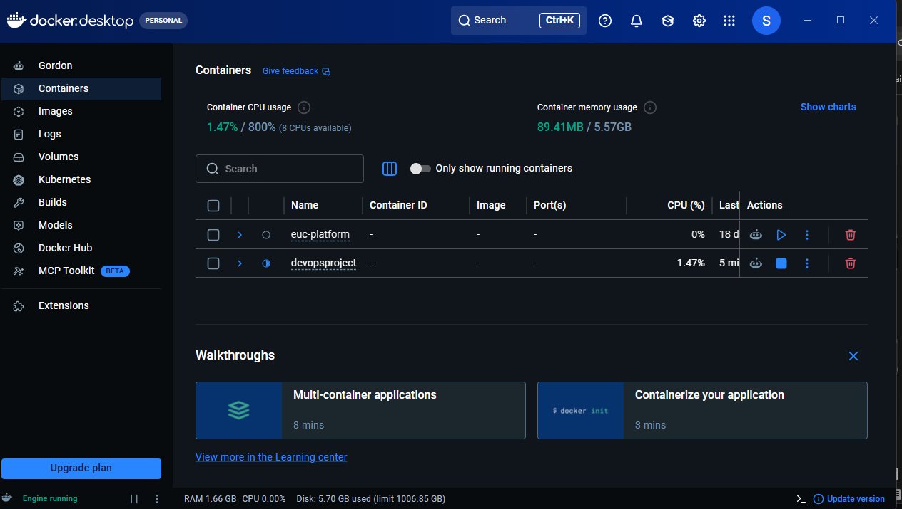

# Netflow — Netflix-Inspired DevOps Project

A containerized, three-tier web application (React SPA + Node/TypeScript API +
PostgreSQL) delivered through a production-grade CI/CD and GitOps pipeline on AWS.
The application itself is a Netflix-style content browser; the project as a whole
is a reference implementation of a modern DevOps delivery workflow.

<!-- Badges are placeholders; enable after pushing to GitHub and wiring the workflows. -->


---

## Contents

- [Overview](#overview)
- [Tech stack](#tech-stack)
- [Repository structure](#repository-structure)
- [Quick start (Docker)](#quick-start-docker)
- [Local development (without Docker)](#local-development-without-docker)
- [Testing](#testing)
- [Delivery pipeline](#delivery-pipeline)
- [Documentation](#documentation)
- [Contributing](#contributing)
- [Security](#security)
- [License](#license)

## Overview

The system is split into a source **application** (this repo) and a declarative
**delivery** path. On every push, Jenkins builds and security-scans an immutable
container image, publishes it, and bumps the image tag in the GitOps configuration.
ArgoCD reconciles that change into Amazon EKS. Prometheus and Grafana observe the
result. See [`ARCHITECTURE.md`](./ARCHITECTURE.md) for the full design and rationale.

```
git push → Jenkins (build · test · scan) → Amazon ECR
        → update GitOps repo → ArgoCD → Amazon EKS → Prometheus/Grafana
```

## Tech stack

| Layer | Technology |
|---|---|
| Frontend | React + TypeScript (Vite), served by Nginx |
| Backend | Node.js + Express (TypeScript), REST API |
| Database | PostgreSQL (Flyway-compatible migrations) |
| Containers | Docker (multi-stage builds) |
| CI | Jenkins + lightweight GitHub Actions checks |
| CD / GitOps | ArgoCD |
| Cloud | AWS (EKS, RDS, ECR, VPC, ALB, Route53, Secrets Manager) |
| Observability | Prometheus, Grafana, Alertmanager, Loki |
| IaC | Terraform |

## Repository structure

```
.
├── ARCHITECTURE.md   Full production architecture & decisions
├── frontend/         React + TypeScript SPA (Netflix-inspired UI)
├── backend/          Express + TypeScript REST API (+ API.md, tests)
├── database/         PostgreSQL schema, migrations, seed data
├── docker/           Container docs + nginx config
├── docker-compose.yml  Local dev stack (db + backend + frontend)
├── jenkins/          Jenkins declarative pipeline (CI)
├── security/         Scanning config (SonarQube, Trivy, OWASP DC, Gitleaks)
├── k8s/              Kubernetes manifests (Kustomize base + overlays)
├── argocd/           ArgoCD Applications (GitOps / CD)
├── monitoring/       Prometheus, Grafana, Alertmanager, Loki
├── infra/            Terraform (AWS infrastructure as code)
├── docs/             Supplementary documentation
└── .github/          Actions workflows, templates, CODEOWNERS
```

## Quick start (Docker)

Requires Docker Engine + Compose.

```bash
cp .env.example .env          # optional; sane local defaults included
docker compose up -d --build
```

| Service | URL |
|---|---|
| Frontend (SPA) | http://localhost:8080 |
| Backend API | http://localhost:4000 |
| Backend health | http://localhost:4000/health |
| Backend readiness | http://localhost:4000/ready |

Tear down with `docker compose down` (add `-v` to drop the database volume).
Full container workflow and a verified test run: [`docker/README.md`](./docker/README.md).

## Screenshots

The application and pipeline running locally / on GitHub:

| | |
|---|---|
|  |  |
|  |  |
|  |  |
|  |  |

## Local development (without Docker)

Requires Node.js 18+ and a running PostgreSQL instance.

```bash
# Backend
cd backend && cp .env.example .env && npm install
npm run migrate && npm run seed && npm run dev   # http://localhost:4000

# Frontend (separate terminal)
cd frontend && cp .env.example .env && npm install
npm run dev                                       # http://localhost:5173
```

See [`backend/README.md`](./backend/README.md), [`frontend/README.md`](./frontend/README.md),
and [`database/README.md`](./database/README.md) for details.

## Testing

```bash
cd backend
npm test          # Vitest unit tests (services + validation)
npm run typecheck # TypeScript type checking
```

## Delivery pipeline

- **Jenkins** owns the full CI/CD pipeline: build, unit tests, SonarQube (SAST),
  Gitleaks, OWASP Dependency-Check, Docker build, Trivy image scan, push to ECR,
  and the GitOps image-tag bump. See [`jenkins/README.md`](./jenkins/README.md).
- **GitHub Actions** runs only lightweight, fast pull-request checks (lint,
  typecheck, unit tests, secret scan) so contributors get quick feedback. It does
  **not** duplicate the Jenkins build/scan/deploy stages. See
  [`.github/workflows`](./.github/workflows).
- **ArgoCD** performs deployment via GitOps. See [`argocd/README.md`](./argocd/README.md).

## Documentation

| Doc | Purpose |
|---|---|
| [docs/PROJECT-OVERVIEW.md](./docs/PROJECT-OVERVIEW.md) | Final project documentation (18 sections) + metrics + resume bullets |
| [ARCHITECTURE.md](./ARCHITECTURE.md) | Full production architecture & decisions |
| [backend/API.md](./backend/API.md) | REST API reference |
| [docker/README.md](./docker/README.md) | Docker workflow |
| [CONTRIBUTING.md](./CONTRIBUTING.md) | Git workflow & PR process |
| [SECURITY.md](./SECURITY.md) | Security policy, threat model & audit report |
| [docs/github-setup.md](./docs/github-setup.md) | GitHub repository settings checklist |
| [docs/PRODUCTION-READINESS.md](./docs/PRODUCTION-READINESS.md) | Readiness checklist & failure-testing plan (14 scenarios) |

## Contributing

We use a `main` / `develop` / `feature/*` branching model with pull-request reviews.
Read [CONTRIBUTING.md](./CONTRIBUTING.md) before opening a PR.

## Security

Never commit secrets. Report vulnerabilities privately per [SECURITY.md](./SECURITY.md).

## License

Released under the [MIT License](./LICENSE).
